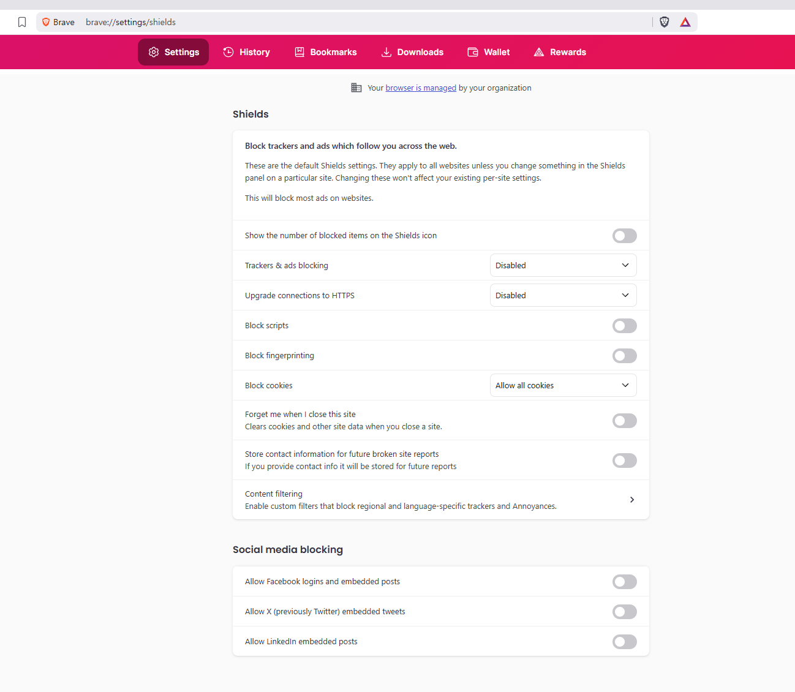
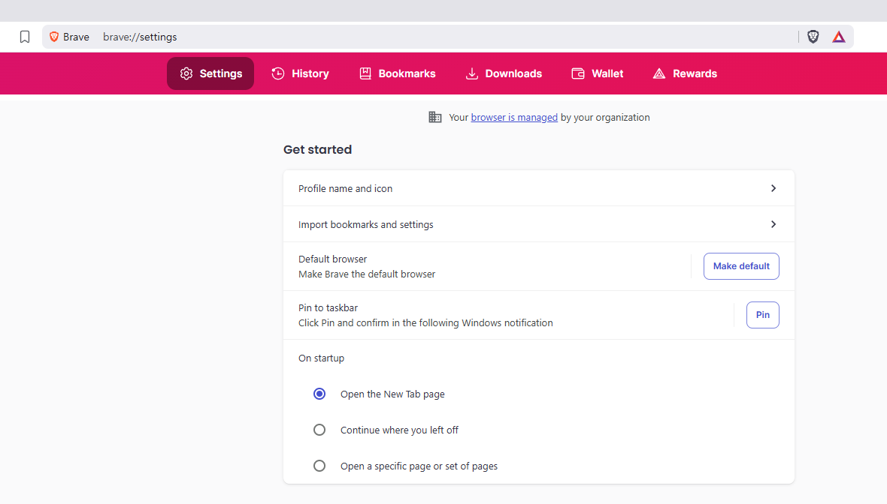

# Minimal Working Example — Brave

This directory provides a self-contained environment to run a complete BUIZZ
pipeline using **Brave** without installing any additional browser.

> [!IMPORTANT]
> **Every command in this document must be run from the `example/` directory.**
> Open a terminal, `cd` into `example/`, and keep it there for all steps.
>
> ```powershell
> cd path\to\BUIZZ\example
> ```

---

## Directory Structure

```
example/
├── setup.py            # Downloads and configures the portable Brave binary
├── mini_scenario.py    # Deploys pre-selected bug scenarios into fuzzer/scenario/
├── samesite_split/     # Pre-selected scenarios for SameSite split-view bug (bug_20)
├── csp_split_blob/     # Pre-selected scenarios for CSP split-view blob: bug (bug_07)
├── csp_split_data/     # Pre-selected scenarios for CSP split-view data: bug (bug_06)
└── fix_scenario/       # Patched scenario variants for comparison
```

---

## Why Brave?

Among the six browsers tested, Brave is the only one suitable for a pinned
reproducible example. Chrome, Firefox, and Opera auto-update on launch; Edge and
Whale do not offer older version archives on their official sites. Brave alone
provides versioned standalone ZIP archives on GitHub Releases with no
auto-update.

---

## Prerequisites

```powershell
# 1. Install Python packages and configure hosts file (run as Administrator)
PowerShell -ExecutionPolicy Bypass -File ..\setup.ps1

# 2. Generate TLS certificates
PowerShell -ExecutionPolicy Bypass -File ..\certs.ps1

# 3. Create the MySQL database
python ..\makeDB.py

# 4. Download and configure the portable Brave binary
python setup.py
```

`setup.py` downloads `brave-v1.80.120-win32-x64.zip` (~200 MB) from the
official Brave GitHub release, extracts it, and updates
`..\fuzzer\browser_info\browser_info.json` to point at the extracted `brave.exe`.

Docker Desktop must be running before Step 1 below.

---

## Disable Brave Shields

Brave's built-in Shields interfere with the fuzzer's cross-site requests.
Go to `brave://settings/shields` and apply the settings shown below:



| Setting | Value |
|---|---|
| Trackers & ads blocking | **Disabled** |
| Upgrade connections to HTTPS | **Disabled** (prevents forced HTTPS redirect on local test domains) |
| Block fingerprinting | **Disabled** |
| Block cookies | **Allow all cookies** |

---

## Configure Brave Startup

Go to `brave://settings/onStartup` and set the startup behavior to
**"Open the New Tab page"** so Brave always starts clean without restoring
previous sessions.



---

## Step 1 — Deploy pre-selected scenarios

The scenarios in this directory were extracted using **window-based slicing** —
a window of scenarios centred around each confirmed vulnerability-triggering
scenario was cut from the full fuzzer corpus. This keeps the example small while
preserving the context needed to reproduce the bug.

Choose which bug to test and run the corresponding command:

| Argument | Policy | Bug |
|---|---|---|
| `1` | SameSite | Split-view bug (bug_20) |
| `2` | CSP | Split-view `blob:` bug (bug_07) |
| `3` | CSP | Split-view `data:` bug (bug_06) |

```bash
python mini_scenario.py 1   # SameSite split-view bug  (bug_20)
python mini_scenario.py 2   # CSP split-view blob: bug (bug_07)
python mini_scenario.py 3   # CSP split-view data: bug (bug_06)
```

The remaining steps use the policy that matches your choice:
`samesite` for argument `1`, `csp1` for arguments `2` or `3`.

---

## Step 2 — Start the report server

```bash
# For SameSite (scenario 1)
cd ..\server\samesite\corpus && docker compose up -d && cd ..\..\..\example

# For CSP (scenario 2 or 3)
cd ..\server\csp && docker compose up -d && cd ..\..\example
```

---

## Step 3 — Collect the baseline

```bash
# SameSite
python scenario_base_line.py -b brave -s samesite

# CSP
python scenario_base_line.py -b brave -s csp1
```

`scenario_base_line.py` reads the scenario files already deployed in
`fuzzer/scenario/brave/<policy>/` and visits only those corpus URLs using
Chrome as the baseline browser (automatically selected).

---

## Step 4 — Run the fuzzer

```bash
# SameSite
python ..\fuzzer\fuzzer.py -s samesite -b brave

# CSP
python ..\fuzzer\fuzzer.py -s csp1 -b brave
```

> ⚠️ Do **not** move the mouse or switch windows while the fuzzer is running.

---

## Step 5 — Analyze inconsistencies

```bash
# SameSite
python ..\analyzer.py -s samesite -b brave

# CSP
python ..\analyzer.py -s csp -b brave
```

Expected output:
```
[strict] flagged N/M interaction rows
[+] Results written to bugs/<policy>/interaction_diff_brave.txt
```

---

## Step 6 — Deduplicate results

```bash
python ..\deduping.py -s samesite -b brave   # or -s csp1
```

Expected output:
```
============================================================
  BUIZZ deduplication - policy=samesite  browser=brave
============================================================
  Raw inconsistency records : 12
  Distinct bugs (after dedup): 4

  Bug #01: (Open link in a split window, <a>, https:)
           browsers : brave
           scenario : 8_DEPTH1.json
           records  : 3

  Bug #02: (Open link in background tab, <a>, https:)
           browsers : brave
           scenario : 1_DEPTH1.json
           records  : 5

  Bug #03: (Open link in new tab, <a>, https:)
           browsers : brave
           scenario : 11_DEPTH1.json
           records  : 2

  Bug #04: (Open link in new window, <a>, https:)
           browsers : brave
           scenario : 13_DEPTH1.json
           records  : 2

  Total distinct bugs: 4
```


The following is a sample record from the analyzer's inconsistency output —
an interaction where Brave's behaviour differed from the baseline:

```
{'browser_name': 'brave', 'scenario_id': '8_DEPTH1.json', 'interaction': 'Open link in a split window', ... ,'leak': 'a-href', 'violation': 'strict', ...}
```

The `violation: strict` field means the `SameSite=Strict` cookie was transmitted
— a behaviour that should be blocked, confirming a SameSite policy bypass.

This bug has been assigned **[CVE-2025-48980](https://www.cve.org/CVERecord?id=CVE-2025-48980)**.

---

## Bugs Reproducible on Brave 1.80.120

| Bug | Policy | Interaction | Status |
|---|---|---|---|
| 6 | CSP | Split view, `data:` | Fixed in Brave 1.84+ |
| 7 | CSP | Split view, `blob:` | Fixed in Brave 1.84+ |
| 20 | SameSite | Split view | Fixed in Brave 1.84+ |
